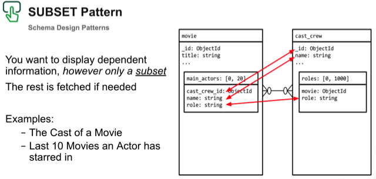

# Distributed Transactions with Subset Schema Design Pattern
Distributed Transactions with Subset Schema Design Pattern



Steps:
#__1. Setup a MongoDB 4.2 Sharded Cluster on Atlas (2 shards is sufficient)

#__2. Setup the IMDB and IMDB_Cast databases on Shard0 and Shard1 respectively as follows: 
```
use IMDB
db.dropDatabase()
sh.enableSharding("IMDB");
sh.shardCollection("IMDB.movies_metadata", { _id: 1 } );
sh.shardCollection("IMDB.movies_credits", { _id: 1 } );
db.adminCommand({ movePrimary: "IMDB", to: "sh_0" });

use IMDB_Cast
db.dropDatabase()
sh.enableSharding("IMDB_Cast");
sh.shardCollection("IMDB_Cast.cast_crew", { _id: 1 } );
db.adminCommand({ movePrimary: "IMDB_Cast", to: "sh_1" });
```
#__3. Extract the [IMDB_data.zip](IMDB_data.zip) file, this contains the 'IMDB__movies_credits.json', 'IMDB__movies_metadata.json' and 'IMDB_Cast__cast_crew.json' files.

#__4. Import the data to each database as follows:
```
mongoimport --host YOURHOST --ssl --username YOURUSER --password YOURPWD --authenticationDatabase admin --db IMDB --collection movies_credits --type JSON --file IMDB__movies_credits.json

mongoimport --host YOURHOST --ssl --username YOURUSER --password YOURPWD --authenticationDatabase admin --db IMDB --collection movies_metadata --type JSON --file IMDB__movies_metadata.json

mongoimport --host YOURHOST --ssl --username YOURUSER --password YOURPWD --authenticationDatabase admin --db IMDB_Cast --collection mcast_crew --type JSON --file IMDB_Cast__cast_crew.json
```

#__5. Execute the script [SubsetPatternWithIMDB_DistTx.js](SubsetPatternWithIMDB_DistTx.js). This will traverse the first 100 documents in the `IMDB.movies_credits` collection and populate the arrays `IMDB_Cast.cast_crew.roles` and `IMDB.movies_metadata.main_actors` arrays using a distributed transaction.

__6. Proof: The `IMDB_Cast.cast_crew` collection will have a `roles` array with a subset of the information of every movie the actress/actor as starred in. The `IMDB.movies_metadata` collection will have a `main_actors` array with a subset of the information of every actress/actor that starred in the movie.
